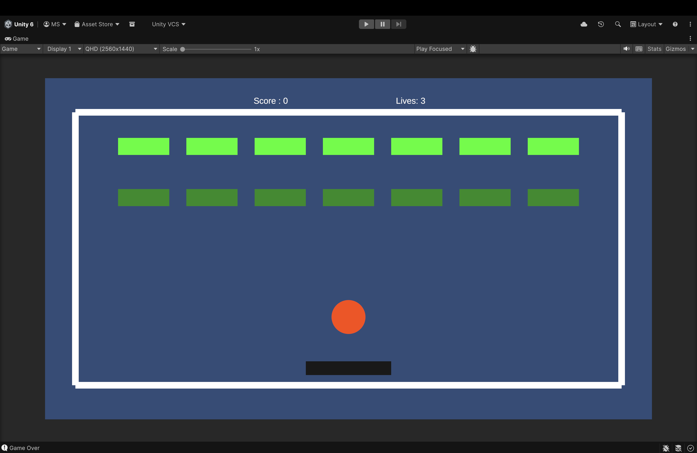
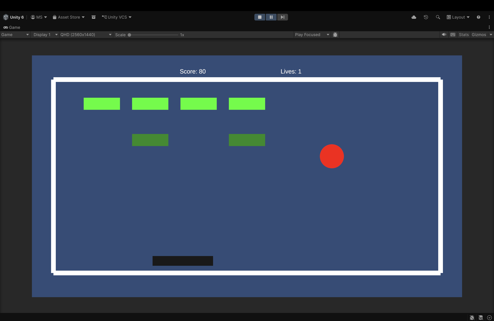

# Breakout Game – 20 Games Challenge #3

🎮 **Game Name:** Breakout  
🛠 **Engine:** Unity 6 
👩‍💻 **Developer:** Meenu K S  

---

## Overview

Breakout is a classic arcade game where the player controls a paddle to bounce a ball and break bricks. The goal is to destroy all bricks without losing all your lives.  

**Features implemented:**
- Paddle controlled by left/right arrow keys.
- Ball bounces off paddle, walls, and ceiling.
- Bricks arranged in rows at the top of the screen.
- Bricks disappear when hit by the ball.
- Score increases for each brick broken.
- Ball speed increases gradually as bricks are broken.
- Life counter starts at 3; game ends when all lives are lost.
- Score and lives displayed on screen.
- Win detection when all bricks are destroyed.

---

## How to Play

1. Open the Unity project in **Unity (version used: 6)**.  
2. Open the scene: `Assets/Scenes/BreakoutScene.unity`.  
3. Press **Play** to start the game.  
4. Use **Left/Right arrow keys** to move the paddle.  
5. Destroy all bricks to win.  
6. Don’t let the ball fall below the paddle, or you’ll lose a life.

---

## Screenshots

  
*Score and lives visible during gameplay*

  
*Game Over or Win state*

---

## What I Learned

- Collision detection between ball, paddle, walls, and bricks.  
- How to manage game state using a GameManager (score, lives, win/lose).  
- Updating UI dynamically with **TextMeshProUGUI**.  
- Incrementing ball speed for progressive difficulty.  
- Basic scene setup and prefab management in Unity.  

---

## Challenges Faced

- Handling ball speed increase without breaking collisions.  
- Ensuring ball bounces correctly at corners.  
- Managing respawn after life loss while keeping gameplay smooth.  
- Detecting win condition accurately when all bricks are destroyed.

---

## How to Run / Download

1. Clone or download this repository.  
2. Open in Unity (version used: insert your version).  
3. Open `Assets/Scenes/BreakoutScene.unity` and press Play.  

---

**#cl-game-dev-3/20games**
